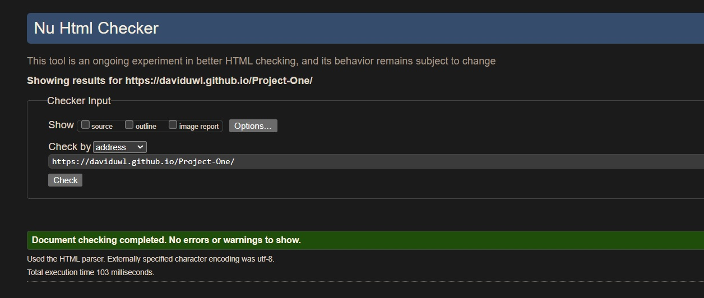
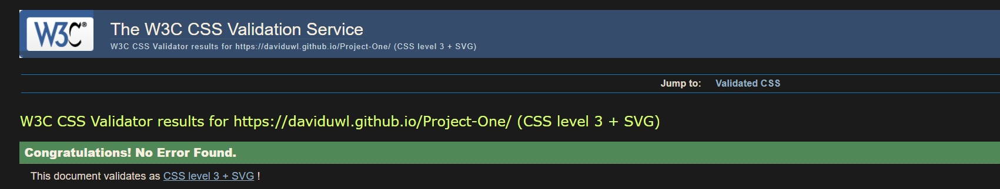

# K Cycles Website
A website designed as a responsive page that allows users to view information about the shop and book a repair. 

 
[Click here to view K Cycles](https://daviduwl.github.io/Project-One/)

* [User Experience (UX)](#user-experience-ux)
  * [Initial Discussion](#initial-discussion)
  * [User Stories](#user-stories)
* [Design](#design)
  * [Colour Palette](#colour-palette)
  * [Typography](#typography)
  * [Imagery](#imagery)
  * [Features](#features)
* [Technologies Used](#technologies-used)
  * [Languages Used](#languages-used)
  * [Libraries & Programs Used](#libraries--programs-used)
* [Deployment & Local Development](#deployment--local-development)
  * [Deployment](#deployment)
* [Testing](#testing)
  * [W3C Validator](#w3c-validator)
  * [Solved Bugs](#solved-bugs)
  * [Known Bugs](#known-bugs)
  * [Tesing User Stories](#testing-user-stories)
  * [Full Testing](#full-testing)
* [Credits](#credits)
* [Media](#media)
* [Acknowledgments](#acknowledgments)

## User Experience (UX)
### Initial Discussion
K cycles was created to represent a bike shop that specialises in buying and selling bikes while also doing repairs. The website allows for the shops new customer base
to be expanded and allow returning customers to book a repair for their bicycle. 

### User Stories
#### First Time Visitor Goals
* To get an idea of what style of bike is sold.
* To have a face they could recognise if they visit the store. 
* to know the shop does repair and book one if needed. 
#### Returning Visitor Goals
* To book a repair quickly. 
* To locate the shop quickly. 

## Design
### Colour Palette 

I create the page with a darker colour palette to match the hero image used for the home page. I created the colour pallete using the [Coolors](http://www.coolors.co) website.

### Typography 
The font Roboto Slab was imported using google fonts.

### Imagery
The images on this site have been granted permission from the owners. They have been credited in the [Credits](#Credits) section.

### Features
The website is made up of five sections:
* Home Page
* About Us
* Repair
* Testimonials and Map
* Social Media Footer

This site has a fixed navigation bar and home button. 
  

The home button tagline will dissapear to clear screen clutter depending on the device used to view the page.  
  

* Home Screen
  * The Home Screen section opens with an animation that strips the home button and nav bar from the screen while maintaining the shop tagline of "Repair.Buy.Sell" and displays an image 
  of a bike. This simplifies the information on screen and conveys to the visitor in an efficient manner the essence of the shop. 
  
* About Us
  * The about us section displays an image of the staff members of the shop and gives a bio of its history and specialisations of the shop. 
  * The image will display on top when viewed on smaller devices so that it still draws attention from the visitor, with both paragraphs dropping below to maintain readability.

* Repair
  * The Repair section displays a background image of a workshop, with a form that allows the visitor to book their own repair. The form can be submitted with their own personal details, 
  and drop down menus to allow them to sub select their service level and bike category with the "Book it!" button. The form requires all details to be completed before it can be submitted, they will 
  be guided with a tooltip if a specific section is not completed. 

* Testimonials and Map
  * The testimonials section conveys longstanding previous customers thoughts on the shop and provide a sense of trust for the shop and its staff. 
  * The map section allows both first time and returning visitors to locate the shop, whether for repair or other services. The map section is an embedded widget from google and is fully 
  interactive and responsive. 

* Social media footer
  * The Social media footer contains all social media links for the shop and allows the shop to gain further exposure it its other online presences. 

## Technologies Used 

### Languages Used 
A Combination of HTML and CSS was used for the creation of this site. 

### Libraries & Programs Used
Github was used as a repository to store website files and code.  
Gitpod used as the coding environment with git for version control.  
Google Dev Tools were used for troubleshooting and testing media queries for multiple device viewports.  
Google maps used for map embedding.  
Google Fonts used to import website fonts.  
Font awesome used to import icons used throughout the website.  

## Deployment & Local Development

### Deployment
Github Pages was used to deploy the live website.  
This can be acheived by following:  
  1. Log into your github account
  2. Select the repository you wish to go live with.
  3. Open the repository settings. 
  4. In your source selection, select main from your branch drop down menu, then select root from your folder menu. 
  5. Click the associated save button and your page will then be deployed via the shown URL. 

## Testing
Throughout the creation of this website build, Google/Chrome dev tools were used to troubleshoot and test different 
elements as they were added. It was also used to verify their responsiveness across multiple viewing platforms.  
During the project many positioning issues were encountered, namely:  
  * Hero image no longer viewable when viewing on smaller devices EG phones. This has been corrected and is now viewable on smaller devices. 
  * About Us section staff image positioning was being obstructed by paragraphs stacking over the image when viewing on smaller devices. This is now solved through the use of media queries. 
  *Positioning of Testimonial section would clutter the Repair section regardless of its position which was raised by a Code Institute tutor - Joanna. This was solved through the use of flexbox and changing it to be contained in a new section allowing the section to declutter. 
 

### W3C Validator
The HTML and CSS code of this site was validated with the use of the W3C validator. 

### Solved Bugs
* When viewing the page on smaller devices, the navigation bar would lose its ability to be interacted with due to the home button and shop name stacking over it. To fix this, i used CSS to change the visibility of the shop name element to hidden, decluttering the screen. This however still left the nav bar unusable, I then changed the width of the home button and shop name elements to _only_ the width of the home button. This resolved the bug. 

### Known Bugs
* The site itself contains empty space on the right side outside of the created sections depending on what device the website is viewed on. Chrome Dev tools was used to try and troubleshoot this, but unfortunately i was unable to find the cause of this empty space. I would like to fix this in the future so that the site is seamless and reduced the impact to the user when viewing the site. 

### Testing User Stories 
#### First time Vistor
* To get an idea of what style of bike is sold.
  * The Hero image itself conveys a clear concise idea of what bicycles are sold instore.
* To have a face they could recognise if they visit the store. 
  * |The About Us Section provides a staff photo, giving each new visitor a face they can recognise.
* to know the shop does repair and book one if needed. 
  * The Repair section and Testimonial section allows each new visitor to know repairs are carried out, and even to book their own repair. 
#### Returning Visitor
* To book a repair quickly. 
  * The use of the nav bar and Repair form allows the returning visitor to acheive quick access to booking a repair. 
* To locate the shop quickly.
  * Within the Testimonial and Map section, the interactive Google Map embedded allows the returning visitor to quickly locate the shop. 

## Full testing
A number of methods were used to fully test this website.
* Two browsers were used:
  * Firefox
  * Google Chrome

* Three devices were used:
  * Desktop PC with three different resolution monitors. 
  * Huawei p30 phone.
  * Samsung Galaxy Tab A Tablet.

* Links 
  1. Home button and nav bar links interacted with across multiple device resolutions to maintain usability with media query restructuring. 
  2. Footer links tested that they link to their corresponding websites. testing that when the link is interacted with, it opens a new window to allow the user to maintain their position on the current website. 

* Repair Form 
  1. The repair form was testing by trying to submit the form with as many permutations of data as possible: 
    * Words in integer formatted fields.
    * special characters only in string fields. 
    * Text in string fields.
    * Numbers in number fields. 
  2. All fields were required to be filled in before submission was possible. I tested this by filling out the form while leaving one section blank and trying to submit each time. 
  3. Once the form was completed in its entirety, i tested the submit button("Book it!") by clicking it and checking that the correct data had been submitted on the back-end, with the correct data labels attached. 

## credits
### Content
All content on this site was written by myself about a fictional bike shop - K Cycles. 

## Media
All images on this site were used with the permission of the owners/people involved. 

[Mikkel Bech -Hero Image Bike ](https://unsplash.com/photos/yjAFnkLtKY0) 
[Casa Du Velo - Workshop Picture](https://casaduvelo.com/en/home/) 
[Radpower Bikes - Staff Picture](https://radpowerbikes.eu/)  

## Acknowledgments
[Stagg Cycles](http://staggcycles.com/) For letting me use their location for the Google Map Location.
[Derek Mcauley](https://github.com/derekmcauley7) For his guidance as my Code Institute mentor.  
Joanna From Code institute for her code review on positioning of my testimonial section. 
