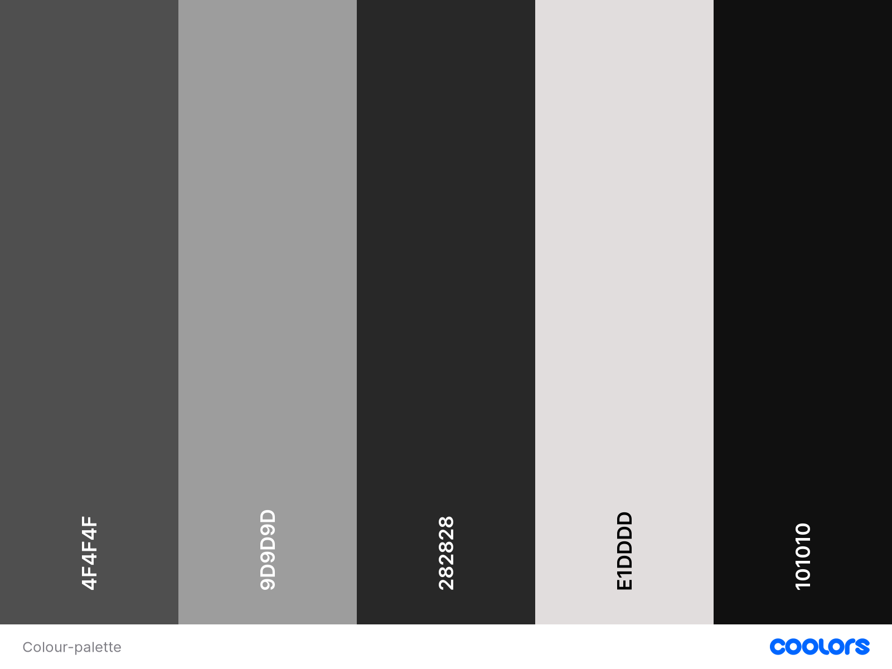
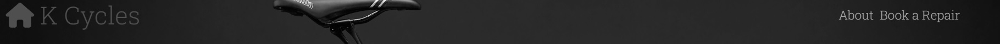
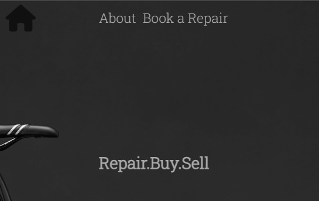

# K Cycles Website
A website designed as a responsive page that allows users to view information about the shop and book a repair. 

 
[Click here to view K Cycles](https://daviduwl.github.io/Project-One/)

* [User Experience (UX)](#user-experience-ux)
  * [Initial Discussion](#initial-discussion)
  * [User Stories](#user-stories)
* [Design](#design)
  * [Colour Palette](#colour-palette)
  * [Typography](#typography)
  * [Imagery](#imagery)
  * [Features](#features)
  * [Accessibility]
* [Technologies Used](#technologies-used)
  * [Languages Used]
  * [Libraries & Programs Used]
* [Deployment & Local Development]
  * [Deployment]
* [Testing]
  * [W3C Validator]
  * [Solved Bugs]
  * [Known Bugs]
  * [Full Testing]
* [Credits]
* [Code Used]
* [Content]
* [Media]
* [Acknowledgments]

## User Experience (UX)
### Initial Discussion
K cycles was created to represent a bike shop that specialises in buying and selling bikes while also doing repairs. The website allows for the shops new customer base
to be expanded and allow returning customers to book a repair for their bicycle. 

### User Stories
#### First Time Visitor Goals
* To get an idea of what style of bike is sold.
* To have a face they could recognise if they visit the store. 
* to know the shop does repair and book one if needed. 
#### Returning Visitor Goals
* To book a repair quickly. 
* To locate the shop quickly. 

## Design
### Colour Palette 

I create the page with a darker colour palette to match the hero image used for the home page. I created the colour pallete using the [Coolors](http://www.coolors.co) website.

### Typography 
The font Roboto Slab was imported using google fonts.

### Imagery
The images on this site have been granted permission from the owners. They have been credited in the [Credits](#Credits) section.

### Features
The website is made up of five sections:
* Home Page
* About Us
* Repair
* Testimonials and Map
* Social Media Footer

This site has a fixed navigation bar and home button. 
  

The home button tagline will dissapear to clear screen clutter depending on the device used to view the page.  
  

* Home Screen
  * The Home Screen section opens with an animation that strips the home button and nav bar from the screen while maintaining the shop tagline of "Repair.Buy.Sell" and displays an image 
  of a bike. This simplifies the information on screen and conveys to the visitor in an efficient manner the essence of the shop. 
  
*About Us
  * The about us section displays an image of the staff members of the shop and gives a bio of its history and specialisations of the shop. 
  * The image will display on top when viewed on smaller devices so that it still draws attention from the visitor, with both paragraphs dropping below to maintain readability.

* Repair
  * The Repair section displays a background image of a workshop, with a form that allows the visitor to book their own repair. The form can be submitted with their own personal details, 
  and drop down menus to allow them to sub select their service level and bike category with the "Book it!" button. The form requires all details to be completed before it can be submitted, they will 
  be guided with a tooltip if a specific section is not completed. 

* Testimonials and Map
  * The testimonials section conveys longstanding previous customers thoughts on the shop and provide a sense of trust for the shop and its staff. 
  * The map section allows both first time and returning visitors to locate the shop, whether for repair or other services. The map section is an embedded widget from google and is fully 
  interactive and responsive. 

* Social media footer
  * The Social media footer contains all social media links for the shop and allows the shop to gain further exposure it its other online presences. 

## Technologies Used 
### Languages Used 
A Combination of HTML and CSS was used for the creation of this site. 

  
