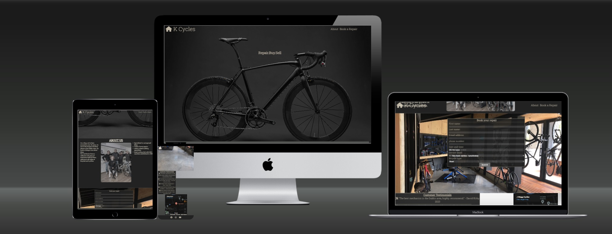

# K Cycles Website
A website designed as a responsive page that allows users to view information about the shop and book a repair. 

 
[Click here to view K Cycles](https://daviduwl.github.io/Project-One/)

* User Experience (UX)
  * Initial Discussion
  * User Stories
* Design
  * Colour Scheme
  * Typography
  * Imagery
  * Features
  * Accessibility
* Technologies Used
  * Languages Used
  * Frameworks, Libraries & Programs Used
* Deployment & Local Development
  *D eployment
* Testing
  * W3C Validator
  * Solved Bugs
  * Known Bugs
* Full Testing
* Credits
* Code Used
* Content
* Media
* Acknowledgments

## User Experience (UX)
K cycles was created to represent a bike shop that specialises in buying and selling bikes while also doing repairs. The website allows for the shops new customer base
to be expanded and allow returning customers to book a repair for their bicycle. 
